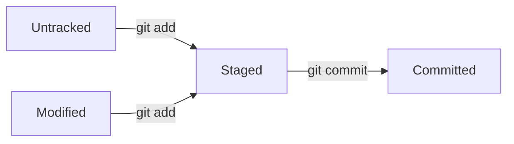

# 📗 Git 全知识体系梳理（含学习历程与问题记录）

> 学习周期：2026-07-13 → 2026-07-16（4 天）
> 总进度：16/18 = 89%
> 学习方式：命令行实操驱动 + 英文原意理解

---

## 一、版本控制概念（GIT1.1）

### 核心思想

Git 用 **commit（存档点）** 解决"改坏了回不去、桌面一堆最终版文件"的痛点。每个 commit 就是一次"快照"，有唯一的哈希编号，可以随时回到任意版本。

### 学到的命令

| 命令 | 英文 | 原意 | 功能 |
|------|------|------|------|
| `git init` | **init**ialize | 初始化 | 创建仓库，生成 `.git` 目录 |
| `git add` | add | 添加 | 工作区 → 暂存区 |
| `git commit -m "消息"` | commit + **m**essage | 提交 + 消息 | 暂存区 → 仓库 |
| `git status` | status | 状态 | 查看仓库当前状态 |
| `git --version` | version | 版本 | 检查 Git 版本 |

### 学习过程遇到的问题

1. **路径写错**：在 cmd 里用了 `/g/...`（Git Bash 写法） → 区分了 cmd（`G:\`）和 Git Bash（`/g/`）的路径差异
2. **在 C 盘误建仓库** → `rmdir /s .git` 删除 `.git` 目录即可
3. **LF/CRLF 警告** → Windows 换行符（CRLF）和 Linux（LF）差异，不影响功能
4. **记不住命令** → 通过英文原意记忆（init=初始化, status=状态, -m=message）

### 核心口诀

> **改 → add → commit**（三步循环）

---

## 二、Git 安装与配置（GIT1.2）

### git config

**config** = **conf**iguration（配置）

三级配置：

| 级别 | 命令 | 文件位置 | 优先级 |
|------|------|---------|:-----:|
| 系统级 | `git config --system` | Git 安装目录（F:/Git/etc/gitconfig）| 最低 |
| 用户级 | `git config --global` | `~/.gitconfig`（C:/Users/admin/.gitconfig）| 中 |
| 仓库级 | `git config --local` | 仓库根目录 `.git/config` | **最高** |

**关键命令**：

```bash
git config --list --show-origin    # 查看所有配置及其来源文件
git config user.name               # 查看当前用户名
git config --global user.name "名字" # 设置用户名
```

### 学习过程遇到的问题

1. **为什么叫 config？** → configuration（配置）的缩写，就像手机设置
2. **配置存在哪？** → `C:/Users/admin/.gitconfig`，纯文本，`[section] key = value` 格式
3. **学生反馈**：GIT1.2 讲得太慢，要求加快节奏 → 后续调整为实操驱动

---

## 三、三区模型（GIT1.3 + GIT1.4）

### 三大区域

```
工作区（Working Directory）─── git add ───> 暂存区（Staging Area/Index）─── git commit ───> 仓库（Repository）
```

| 区域 | 英文 | 硬盘位置 | 作用 |
|------|------|---------|------|
| **工作区** | Working Directory | `.git` 外面的文件 | 你正在编辑的地方 |
| **暂存区** | Staging Area / Index | `.git/index` | 待提交的文件清单 |
| **仓库** | Repository | `.git/objects/` | 存所有历史版本 |

### 文件四种状态



| 状态 | 显示在 `git status` | 含义 |
|------|-------------------|------|
| **Untracked** | `Untracked files:` | Git 不认识的新文件，在工作区 |
| **Modified** | `Changes not staged for commit:` | 已跟踪但修改了，没 add，在工作区 |
| **Staged** | `Changes to be committed:` | 已 add，等 commit，在暂存区 |
| **Committed** | （不显示）| 已存档，在仓库 |

### `git add` 的双重作用

1. **对新文件** → 开始追踪（Git 从"不认识"变成"认识"）
2. **对已修改文件** → 把修改放进暂存区

### 学习过程遇到的问题

1. **不理解为什么要有暂存区** → 类比购物车，可以挑选哪些修改提交
2. **文件同时在工作区和暂存区** → 同一个文件两个版本：工作区最新版、暂存区旧版
3. **staged 什么意思？** → 已经放进暂存区（staging area），等待提交

---

## 四、查看差异与历史（GIT2.2 + GIT2.3）

### git diff - difference（差异）

| 命令 | 对比范围 | 适用场景 |
|------|---------|---------|
| `git diff` | 工作区 ↔ 暂存区 | 还没 add，看改了什么 |
| `git diff --staged` | 暂存区 ↔ 最新 commit | add 后，看即将提交什么 |
| `git diff HEAD` | 工作区 ↔ 最新 commit | 跳过暂存区直接对比 |
| `git diff A B` | 两次 commit 之间 | 看版本变化 |

**`-` 开头的行** = 删除/旧版本；**`+` 开头的行** = 添加/新版本

### git log - log（日志）

| 参数 | 作用 | 英文 |
|------|------|------|
| `--oneline` | 一行一个提交 | 一行 |
| `-2` / `-3` | 限制条数 | 数字 |
| `-p` | 显示具体改动 | **p**atch |
| `--stat` | 文件统计 | **stat**istics |
| `--author="名字"` | 按作者过滤 | author |
| `--since="1 day ago"` | 时间过滤 | since |
| `--graph --all` | 图形显示分叉 | graph |
| `--decorate` | 显示分支/标签指向 | decorate |

### git blame - blame（责备）

**blame** = 责备、归咎。逐行追责：`commit哈希 (作者 日期+时区 行号)`

### 学习过程遇到的问题

1. **`--since="2026-07-14"` 无输出** → 时区问题，改用 `--since="1 day ago"` 解决
2. **`-2` 和 `-p` 顺序能不能换？** → 可以，参数顺序不敏感

---

## 五、撤销操作（GIT2.2 + GIT2.5）

### git reset - reset（重置）

| 命令 | 效果 | 英文 |
|------|------|------|
| `git reset 文件` | 暂存区 → 工作区（add 的反向）| reset（重置）|
| `git reset HEAD~1` | 撤销最近 commit，修改留在工作区 | HEAD~1（往回1步）|
| `git reset --soft HEAD~1` | 撤销 commit，修改留在暂存区 | soft（软的）|
| `git reset --hard HEAD~1` | 撤销 commit，修改全丢 ⚠️ | hard（硬的）|

### git restore - restore（恢复）

| 命令 | 效果 | 英文 |
|------|------|------|
| `git restore 文件` | 丢弃工作区修改（用暂存区覆盖）⚠️ 内容丢失 | restore（恢复）|
| `git restore --staged 文件` | 暂存区 → 工作区（内容不丢）| staged（暂存的）|

### git stash - stash（藏起来）

```bash
git stash       # 半成品藏起来 → 工作区变干净
git stash list  # 查看 stash 列表
git stash show  # 看 stash 改了哪些文件
git stash pop   # 取回来（pop = 弹出）
```

**stash 存在哪？** → `.git/refs/stash`，本质是一个 commit 对象。

### git revert - revert（还原）

```bash
git revert HEAD    # 产生一个新 commit 来"抵消"上次的修改
```

**reset vs revert**：

| | `git reset` | `git revert` |
|:---|:----------|:------------|
| 历史被改写？ | ✅ 是 | ❌ 否 |
| 已经 push 能用？ | ❌ 不行 | ✅ 可以 |
| 比喻 | 撕掉日记本的一页 | 在日记本上写"此条作废" |

### 学习过程遇到的问题

1. **restore 和 reset 什么区别？** → `restore` 只操作文件，`reset` 还能操作 commit
2. **stash 为什么需要？文件不是已经在本地了吗？** → 为了切分支时工作区干净
3. **reset --soft 是啥？** → 撤销提交但修改保留在暂存区
4. **revert 不删历史是什么意思？** → 旧 commit 还在，新加一条"反做"记录

---

## 六、标签管理（GIT2.4）

### git tag - tag（标签）

```bash
git tag v1.0.0                # 轻量标签
git tag -a v1.1.0 -m "消息"   # 附注标签（-a = annotated）
git tag -l                    # 列出标签（-l = list）
git log --oneline --decorate  # 查看标签指向
```

**标签 vs 分支**：标签固定不动，分支随 commit 前进。

---

## 七、进阶操作（GIT2.5）

### git rebase - rebase（重新设定基础）

**rebase** = re（重新）+ base（基础）

```bash
git switch feature
git rebase main    # 把 feature 的提交"移植"到 main 最新位置
```

**merge vs rebase**：

| | merge | rebase |
|:---|:-----|:-------|
| 历史 | 有分叉线 | 一条直线 |
| 是否有 merge commit | ✅ 有 | ❌ 没有 |
| 已 push 能用？ | ✅ 可以 | ❌ **不可以** |

⚠️ **黄金法则**：永远不要对已经推送到远程的 commit 做 rebase。

### git cherry-pick - cherry-pick（拣选）

```bash
git cherry-pick 哈希值    # 只挑某一个 commit 合到当前分支
```

| 命令 | 搬什么 |
|------|--------|
| `git merge` | 整个分支 |
| `git rebase` | 整条分支（改写历史）|
| `git cherry-pick` | **只挑一个 commit** |

### git reflog - reference log（引用日志）

```bash
git reflog
# HEAD@{0}: commit: xxx
# HEAD@{1}: checkout: moving from main to feature
```

**reflog** = reference log（引用日志）。记录所有 HEAD 移动历史，找回"误删"数据的终极手段。

### .gitignore - ignore（忽略）

```bash
*.exe            # 忽略所有 .exe
node_modules/    # 忽略整个文件夹
/build/          # 忽略特定路径
```

⚠️ `.gitignore` **只对未追踪（Untracked）文件有效。** 已追踪的文件先 `git rm --cached` 再忽略。

查看被忽略的文件：`git status --ignored`

### 学习过程遇到的问题

1. **rebase 说"没有内容"** → 因为有 unstaged changes，先 `git stash` 再 rebase
2. **cherry-pick 看不懂图** → `git log --oneline main..feature` 只看独有提交
3. **`.gitignore` 放哪？** → 必须放在仓库根目录

---

## 八、分支管理（GIT3）

### 分支本质

**分支是一个指向 commit 的指针。** 存在 `.git/refs/heads/` 目录下，每个分支一个文件，里面写着一个哈希值。

**HEAD 指针**：存在 `.git/HEAD` 文件里，写着 `ref: refs/heads/当前分支名`。

| 操作 | 修改了什么文件 |
|------|--------------|
| `git commit` | `.git/refs/heads/当前分支`（哈希前进）|
| `git switch 分支` | `.git/HEAD`（改成别的分支名）|
| `git tag 标签` | `.git/refs/tags/标签名`（新建文件）|

### 分支操作命令

| 命令 | 英文 | 功能 |
|------|------|------|
| `git branch 名字` | branch（树枝）| 创建分支 |
| `git switch 名字` | switch（切换）| 切换分支 |
| `git merge 名字` | merge（合并）| 合并分支到当前分支 |
| `git branch -d 名字` | **d**elete | 删除已合并的分支 |
| `git branch -D 名字` | **D**elete force | 强制删除（未合并也删）|
| `git branch -v` | **v**erbose | 查看本地分支详细信息 |
| `git branch -r` | **r**emote | 查看远程分支 |

### 合并冲突

**为什么产生**：两个分支改了**同一行**，Git 不知道该听谁的。

```bash
<<<<<<< HEAD
当前分支的版本
=======
要合并过来的版本
>>>>>>> feature-login
```

**解决步骤**：手动编辑 → 删掉 `<<<<<<<` `=======` `>>>>>>>` → 保留需要的 → `git add` → `git commit`

### 学习过程遇到的问题

1. **分支是什么？** → 指向 commit 的指针（贴纸）
2. **合并是指针追赶？** → Fast-forward = 直线追，不产生 merge commit
3. **为什么追加同一行也冲突？** → Git 按行比较，不是按操作理解
4. **删除分支做了什么？** → 只删指针文件（`.git/refs/heads/`），commit 数据还在
5. **删掉的 commit 去哪了？** → 在 `git gc` 前都还在，`git reflog` 能找到

---

## 九、分支策略（GIT3.2 + GIT3.3）

### Git Flow（5 种分支）

| 分支 | 用途 | 生存期 |
|------|------|:-----:|
| `main` | 正式发布版 | 永久 |
| `develop` | 日常开发集散地 | 永久 |
| `feature/xxx` | 新功能开发 | 临时 |
| `release/x.x` | 发布前修复 | 临时 |
| `hotfix/xxx` | 紧急修 bug | 临时 |

流程：`feature → develop → release → main`

### GitHub Flow（2 种分支）

| 分支 | 用途 | 生存期 |
|------|------|:-----:|
| `main` | 永远可发布 | 永久 |
| `feature/xxx` | 开发/修 bug | 临时 |

流程：`feature → main（通过 PR）`

### 分支命名规范

```
feat/xxx      # 新功能
fix/xxx       # 修 bug
docs/xxx      # 文档
refactor/xxx  # 重构
test/xxx      # 测试
```

---

## 十、远程协作（GIT4）

### SSH 配置

```bash
ssh-keygen -t rsa -b 4096 -C "你的标识"   # 生成密钥
# 公钥复制到 GitHub → Settings → SSH and GPG keys
ssh -T git@github.com                    # 测试连接
```

### 远程仓库命令

| 命令 | 英文 | 功能 |
|------|------|------|
| `git remote add origin 地址` | remote（远程的）+ add | 添加远程仓库 |
| `git remote -v` | **v**erbose | 查看远程仓库地址 |
| `git push -u origin main` | push + **u**pstream | 推送并设置默认路线 |
| `git push` | push | 简写推送（设过 -u 后）|
| `git pull origin main` | pull（拉）| 拉取并自动合并 |
| `git fetch origin main` | fetch（去拿）| 只下载不合并 |
| `git clone 地址` | clone（克隆）| 复制远程仓库到本地 |

**`git pull` = `git fetch` + `git merge`**

### 远程地址格式

```
git@github.com:用户名/仓库名.git
  ↑     ↑         ↑       ↑
登录名 服务器   你的路径  .git 后缀
```

### origin/main 是什么

`origin/main` = 本地存的远程镜像，存在 `.git/refs/remotes/origin/main`。是"我上次从远程拉到的那个 commit"，**不是真正的远程**。

### 学习过程遇到的问题

1. **SSH 连接被拒** → 国内 22 端口不稳，配置 `~/.ssh/config` 改用 443 端口
2. **remote add 的地址哪来的？** → GitHub 创建仓库后自动生成
3. **为什么 fetch 和 push 地址一样？** → 同一个仓库的两个操作方向
4. **origin/main 什么意思？** → 本地存的远程快照
5. **克隆别人的仓库，我 GitHub 上会有吗？** → 不会，只在你本地

---

## 十一、CI/CD 入门（GIT5.1）

**CI** = Continuous Integration（持续集成）= push 后自动测试
**CD** = Continuous Deployment（持续部署）= 测试后自动上线

### GitHub Actions

配置文件必须放在：**仓库根目录/.github/workflows/*.yml**

```yaml
name: CI
on: [push]
jobs:
  test:
    runs-on: ubuntu-latest
    steps:
      - uses: actions/checkout@v4
      - run: npm test
```

### 学习过程遇到的问题

1. **Action 页面找不到** → 因为没有把 workflow 放在仓库根目录，修复后正常
2. **`.github/workflows/` 该放哪？** → 必须放仓库根目录（`.git` 所在目录）

---

## 📊 最终掌握情况

| 领域 | 进度 | 掌握程度 |
|:-----|:---:|:--------:|
| GIT1 基础概念 | **4/4** ✅ | 三区模型、配置、状态流转 |
| GIT2 本地操作 | **5/5** ✅ | add/commit/diff/log/reset/restore/stash/tag/rebase/cherry-pick/revert/reflog |
| GIT3 分支管理 | **3/3** ✅ | 分支创建/切换/合并/冲突/Git Flow/GitHub Flow |
| GIT4 远程协作 | **1/3** 🟡 | push/pull/fetch/clone/SSH |
| GIT5 CI/CD | **1/3** 🟡 | GitHub Actions 入门 |
| **总计** | **16/18 = 89%** 🚀 | |

---

## 🔑 核心口诀

> **改 → add → commit**（三步循环）
> **工作区 → 暂存区 → 仓库**（三区流转）
> **本地 → push → 远程**（远程协作）
> **reset 改历史，revert 加记录**（撤销选择）
> **merge 不分叉，rebase 一条线**（合并选择）
